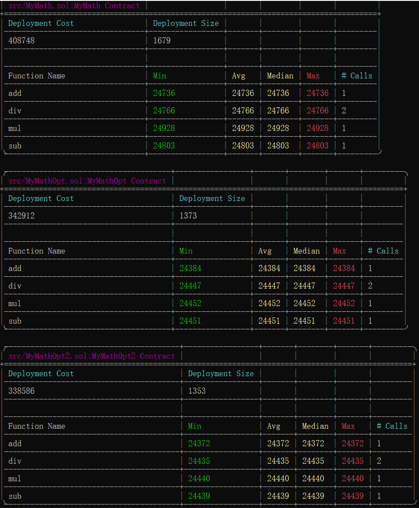

# Foundry理论

## Foundry

**Foundry is a blazing fast, portable and modular toolkit for Ethereum application development written in Rust.**

Foundry consists of:

- **Forge**: Ethereum testing framework (like Truffle, Hardhat and DappTools).
- **Cast**: Swiss army knife for interacting with EVM smart contracts, sending transactions and getting chain data.
- **Anvil**: Local Ethereum node, akin to Ganache, Hardhat Network.
- **Chisel**: Fast, utilitarian, and verbose solidity REPL.

## Documentation

https://book.getfoundry.sh/

## Usage

### Build

```shell
$ forge build
```

### Test

```shell
$ forge test
```

### Format

```shell
$ forge fmt
```

### Gas Snapshots

```shell
$ forge snapshot
```

### Anvil

```shell
$ anvil
```

### Deploy

```shell
$ forge script script/Counter.s.sol:CounterScript --rpc-url <your_rpc_url> --private-key <your_private_key>
```

### Cast

```shell
$ cast <subcommand>
```

### Help

```shell
$ forge --help
$ anvil --help
$ cast --help
```
# Foundry实战

## 利用 Forge 搭建一个简单的智能合约测试环境，编写一个包含基本算术运算（如加法、减法）的智能合约，并对其进行单元测试。
forge init foundry-stu
## 要求在测试过程中记录并分析合约的 Gas 消耗情况。
forge build

forge test --gas-report
## 针对上述智能合约，尝试进行至少两种不同的 Gas 优化策略（例如优化合约代码结构、减少不必要的操作等）
1、将操作进行unchecked
2、在1基础上将四个事件合并成一个事件，同时减少变量定义，r
## 优化分析报告。
